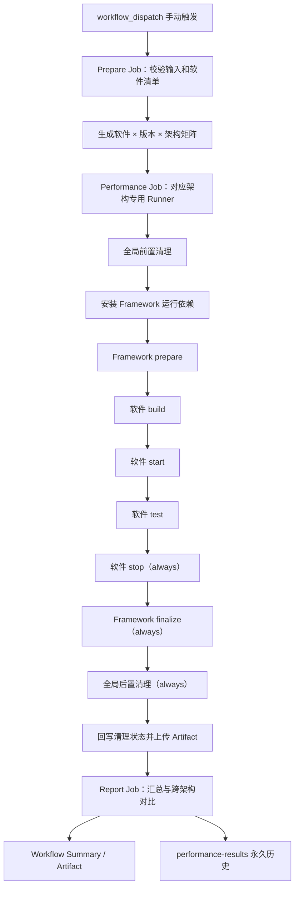

# BoostKit Performance Evaluation

本项目通过一个仅支持手动触发的 GitHub Actions Workflow，在专用裸机 Runner 上对开源软件执行 x86_64 与 aarch64 性能测试。软件清单和测试代码由人工维护，公共 Framework 负责矩阵生成、阶段编排、进程隔离、环境清理、指标校验、跨架构报告和结果持久化。

当前接入 Redis 和 LZ4：Redis 支持 `7.4.10`、`8.0.0`、`8.0.6`，LZ4 支持 `1.9.4`、`1.10.0`。默认手动运行会把五个软件版本分别展开到 x86_64 与 aarch64，共生成 10 个性能任务。

## 核心设计

- Workflow 使用 `workflow_dispatch` 手动触发。
- 默认运行全部启用的软件、全部声明版本和两个架构，也支持手动缩小软件、版本或架构范围。
- 性能任务在带有对应架构标签的专用裸机 Runner 上完成源码编译、安装和测试。
- 每个软件实现 build、start、test、stop 四个阶段。
- Framework 统一实现 prepare、finalize、指标提取、报告、环境清理和永久历史。
- 新软件通过人工适配已有测试代码接入。
- 公共配置统一维护架构和 Runner 标签，软件清单负责软件自身的版本、阶段、输出和指标。
- `config/categories.yaml` 同时维护分类顺序和各分类的软件注册列表，矩阵以注册内容为执行范围。

## 手动运行

在 GitHub 仓库的 Actions 页面选择 `Manual performance evaluation`，通过 `Run workflow` 启动。

每次运行标题按手动输入动态生成，例如 `Performance evaluation - lz4 1.10.0 (all)`，用于直接区分软件、版本和架构范围。

| 输入 | 默认值 | 用途 |
|---|---|---|
| `software` | `all` | 软件名、逗号分隔的软件名，或全部软件。 |
| `version` | `all` | 版本、逗号分隔的版本，或全部声明版本。 |
| `architecture` | `all` | `all`、`x86_64` 或 `aarch64`；`all` 默认运行两个架构。 |
| `update_baseline` | `false` | 是否用本次成功的双架构结果更新 `baseline.json`。 |

`update_baseline=true` 时必须选择 `architecture=all`。只有两个架构的测试和后置清理全部成功，才允许更新基线。

仓库使用固定并发组 `dedicated-performance-runners`，多次手动运行按触发顺序等待专用性能资源。

## Workflow 执行流程



### Prepare Job

Prepare Job 在 `ubuntu-latest` 上执行：

1. 校验 Baseline 更新范围。
2. 从默认 PyPI 安装固定版本的 PyYAML。
3. 使用 `framework/catalog.py matrix` 一次完成全部软件清单校验和矩阵生成。
4. 把矩阵写入 Job 输出和 Workflow Summary。

Catalog 会检查注册表与实际 `case.yaml` 双向一致、目录与清单名称一致、软件名全局唯一、版本非空、四阶段入口声明完整、脚本路径安全且存在、函数名合法、预期输出安全、指标定义完整，以及软件清单字段边界。注册项、目录和清单必须完整对应，校验通过后才生成矩阵。

### Performance Job

矩阵中的每个软件、版本和架构对应一个独立 Job。Workflow 通过 `matrix.runner_label` 选择专用 Runner，并依次调用：

```text
prepare → build → start → test → stop → finalize → cleanup
```

阶段严格串行。Workflow 只向 Framework 传入阶段名；Framework 根据 `case.yaml` 查找该阶段声明的脚本和函数，加载脚本并调用对应函数。当前阶段函数退出且 stdout/stderr 全部转发完毕后，Workflow 才会进入下一步。每个软件阶段的控制台输出同时保存为 `command-<stage>.log`。

| 阶段 | 所属层 | 职责 |
|---|---|---|
| `prepare` | Framework | 校验实际架构、创建运行上下文、采集测试前环境。 |
| `build` | 软件 + Framework | 软件裸机编译并报告实际版本；Framework 校验版本并生成统一构建信息。 |
| `start` | 软件 | 启动被测服务并等待就绪；无服务软件校验测试运行时已准备完成。 |
| `test` | 软件 | 执行性能基准，聚合并写出清单声明的结果文件。 |
| `stop` | 软件 | 幂等停止服务并确认退出；无服务软件执行幂等收口；失败路径也执行。 |
| `finalize` | Framework | 采集测试后环境、严格校验输出、提取指标、生成单架构报告。 |
| `cleanup` | Framework | 全局清理 Runner，并把清理结果回写到状态和规范化结果。 |

阶段超时、Workflow 取消或 Runner 收到终止信号时，Framework 会终止外层 Shell 及其整个阶段进程组。`start` 启动的被测服务可以保留到下一阶段，并由 `stop` 和全局清理共同收口。

### Report Job

Report Job 始终尝试下载全部架构 Artifact，并完成：

- 单架构任务状态和指标汇总；
- 同软件、同版本的 x86_64/aarch64 参数一致性校验；
- 跨架构指标计算和 Markdown 报告；
- JUnit XML；
- Workflow Summary；
- 汇总报告 Artifact；
- 成功任务的永久结果准备和发布。

## Runner 配置

Runner 标签集中维护在 `config/defaults.yaml`：

| 架构 | Runner 标签 |
|---|---|
| `x86_64` | `PERF_RUNNER_X86_64` |
| `aarch64` | `PERF_RUNNER_ARM64` |

Workflow 从 `config/defaults.yaml` 读取标签映射；更换 Runner 标签时修改该文件。

性能 Runner 必须满足：

- 专用于性能测试的裸机；
- 实际 CPU 架构与 Runner 标签一致；
- 预装 Python 3.11+、pip、Git、编译器和软件清单要求的系统编译依赖；
- 能够访问 GitHub；软件源码和测试数据均在任务隔离目录中按固定版本下载；
- 允许测试用户管理 `/tmp/boostkit-perf` 下的全部内容和测试进程；
- 允许测试用户免密且仅以 root 执行固定的 `LC_ALL=C lscpu`，用于读取物理机 DMI/SMBIOS 中的完整 CPU 型号；
- 系统编译依赖在 Runner 注册前完成安装，测试使用注册时的固定宿主机环境；
- 所有源码、构建、缓存、数据、临时文件和安装前缀必须进入 `/tmp/boostkit-perf`。

CPU 型号通过下列命令读取 `lscpu` 的 `Model name` 字段：

```bash
/usr/bin/sudo -n /usr/bin/env LC_ALL=C /usr/bin/lscpu
```

在每台性能 Runner 上通过 `sudo visudo -f /etc/sudoers.d/perf-lscpu` 写入以下最小权限规则；示例中的 `runner` 应替换为实际 Actions 服务账户名：

```text
runner ALL=(root) NOPASSWD: /usr/bin/env LC_ALL=C /usr/bin/lscpu
```

使用 Actions 服务账户验证配置：

```bash
sudo -u runner /usr/bin/sudo -n /usr/bin/env LC_ALL=C /usr/bin/lscpu
```

该命令执行失败或 `Model name` 为空时，报告将 CPU 型号记录为 `unknown`。

## Python 依赖

Workflow 声明以下 Framework 运行依赖：

```text
PyYAML==6.0.2
```

Ubuntu Prepare Job 使用 pip 默认的 PyPI。专用 Performance Runner 使用阿里云 PyPI 镜像：

```text
https://mirrors.aliyun.com/pypi/simple/
```

Prepare Job 把依赖安装到 `${RUNNER_TEMP}/boostkit-framework-deps`。每个 Performance Job 在全局前置清理后，把依赖安装到 `/tmp/boostkit-perf/framework-deps`，后续全部阶段共同复用，并在全局后置清理时统一删除。两类 Job 都使用任务私有依赖目录。

Prepare 与 Performance 分别在各自的 Job 中安装一次依赖；Report Job 使用 Python 标准库生成报告。

## 全局环境清理

清理入口是 `framework/cleanup_environment.sh`，只允许在同时满足以下条件时运行：

- `PERF_DEDICATED_RUNNER=true`；
- `PERF_WORK_ROOT=/tmp/boostkit-perf`；
- 参数为 `--before`、`--after` 或 `--verify`。

前置和后置清理都以整个 `/tmp/boostkit-perf` 为作用范围：

1. 扫描所有引用工作根目录或带有性能运行隔离标识的进程。
2. 先发送 `SIGTERM`，宽限期结束后向残留进程发送 `SIGKILL`。
3. 查找并卸载工作根目录下的遗留挂载点。
4. 删除工作根目录下的全部源码、构建、安装、缓存、数据、虚拟环境和临时文件。
5. 二次扫描进程、文件和挂载点。
6. 任一残留存在时立即失败，Runner 应停止继续承载性能任务并进入维护。

进程扫描同时检查：

- `PERF_PROCESS_TOKEN` 和 `PERF_WORK_DIR` 环境变量；
- 命令行参数；
- 当前工作目录；
- 可执行文件路径；
- 已打开文件描述符。

进程环境和资源引用共同覆盖后台服务识别。

## 项目文档

已有测试脚本通过统一指南适配目录、阶段入口、结果和指标契约：

- [已有测试脚本接入指南](doc/SOFTWARE_INTEGRATION.md)

`doc/SOFTWARE_INTEGRATION.md` 负责已有脚本适配规范，`doc/TEST_SCRIPT_DEVELOPMENT.md` 预留为测试脚本开发规范。

## 结果和指标契约

每个软件阶段必须生成 `case.yaml` 中归属于该阶段的必要输出。Framework 会在阶段结束时立即检查，并在 finalize 按以下条件再次验收全部结果：

- 文件存在且包含内容；
- JSON 语法有效且根节点为对象；
- 指标引用的逻辑输出和点路径存在；
- 指标值为有限数值；
- 至少提取一个指标。

Framework 从软件 JSON 提取数值后，统一生成以下指标结构：

```json
{
  "value": 1000,
  "unit": "ops/s",
  "direction": "higher_is_better"
}
```

支持的优化方向：

| 值 | 报告说明 |
|---|---|
| `higher_is_better` | 越大越好 |
| `lower_is_better` | 越小越好 |
| `neutral` | 仅展示 |

跨架构对比要求两个结果的软件、版本、工作负载定义、参数签名、指标集合、单位和优化方向全部一致。越小越好的指标会反向换算相对性能，使“相对性能大于 1”始终表示 aarch64 更优。

汇总报告中的单架构指标按 aarch64 和 x86_64 两个小标题分组，指标顺序与跨架构对比表保持一致。

单架构 `report.md` 和整次运行的 `combined-report.md` 都包含测试环境。单架构报告显示当前架构；Workflow Summary 和汇总报告将构建信息、静态系统信息分别成表，同一项目的 x86 与 aarch64 值按列横向对照，并按软件和版本分组。测试前后的运行状态保存在结果 JSON 中。

Workflow Summary、汇总 Artifact 和 `performance-results` 中的软件版本级 `combined-report.md` 统一调用 `render_summary()`。永久报告包含当前软件和版本的汇总内容，各架构独立报告保存在对应子目录。

## 输出目录和保存策略

单个矩阵任务的仓库工作区输出：

```text
.perf-output/<category>/<software>/<version>/<arch>/<run_id>/
```

主要包含：

```text
system_info.json
runtime_before.json
runtime_after.json
build_info.json
status.json
normalized_result.json
report.md
command-build.log
command-start.log
command-test.log
command-stop.log
软件声明的原始结果文件
```

`.perf-output/` 的生命周期限定在本次 Workflow 工作区。

结果通过三种方式保存：

| 位置 | 内容 | 保留策略 |
|---|---|---|
| Workflow Summary | 矩阵、任务状态、单架构指标和跨架构对比 | 随 Actions Run 保存 |
| GitHub Actions Artifact | 原始结果、阶段日志、规范化结果和汇总报告 | 架构结果 30 天，汇总报告 90 天 |
| `performance-results` 分支 | 精简最终结果、报告、运行元数据和 Baseline | 永久保存 |

`performance-results` 分支结构：

```text
<category>/<software>/<version>/
├── baseline.json
└── <run_id>-<attempt>/
    ├── manifest.json
    ├── combined-report.md
    ├── x86_64/
    │   ├── normalized_result.json
    │   ├── report.md
    │   └── 软件声明的 JSON 输出
    ├── aarch64/
    │   ├── normalized_result.json
    │   ├── report.md
    │   └── 软件声明的 JSON 输出
    └── comparison.json
```

每个 `<run_id>-<attempt>` 对应一个不可变历史目录。构建日志、大型原始文件、源码和二进制保存在限期 Artifact 中；Git 历史保存精简结果。

`baseline.json` 用于记录人工确认的双架构参考运行，保存来源 Run、提交 SHA、Workflow URL、参数签名和指标，并通过手动运行的 `update_baseline` 输入更新。

## 本地检查

Ubuntu 本地环境直接使用默认 PyPI 安装验证依赖：

```bash
python3 -m pip install \
  "PyYAML==6.0.2" "pytest>=8.0,<10.0"
```

其他环境使用阿里云镜像：

```bash
python3 -m pip install \
  --index-url https://mirrors.aliyun.com/pypi/simple/ \
  "PyYAML==6.0.2" "pytest>=8.0,<10.0"
```

校验软件清单：

```bash
python3 framework/catalog.py validate
```

查看默认双架构矩阵：

```bash
python3 framework/catalog.py matrix \
  --software all \
  --version all \
  --architecture all \
  --pretty
```

运行 Framework 单元测试：

```bash
python3 -m pytest framework/tests
```

`framework/tests` 使用临时目录、假软件入口和短生命周期进程验证公共 Framework，覆盖软件清单、阶段调度、结果处理、报告和清理逻辑。

## 文件职责

本节覆盖版本库内的正式源文件、配置和文档。

### 根目录与 Workflow

| 文件 | 用途 |
|---|---|
| `README.md` | 项目总览，包含架构、运行方式、公共流程和文档入口。 |
| `.gitignore` | 排除运行产物、缓存、历史结果工作区和本地临时文件。 |
| `.github/workflows/performance-test.yml` | 唯一 Workflow；处理手动输入、矩阵、双架构任务、前后清理、报告和永久历史。 |

### 公共配置

| 文件 | 用途 |
|---|---|
| `config/categories.yaml` | 分类顺序和分类下软件列表的唯一注册表；空值表示当前没有软件。 |
| `config/defaults.yaml` | 默认双架构、架构到 Runner 标签的唯一映射、输出根目录和裸机工作根目录。 |

### 项目文档

| 文件 | 用途 |
|---|---|
| `doc/SOFTWARE_INTEGRATION.md` | 将已有测试脚本适配到四阶段、结果和指标接口的正式指南。 |
| `doc/TEST_SCRIPT_DEVELOPMENT.md` | 测试脚本开发说明的空白占位文档。 |

### Framework

| 文件 | 用途 |
|---|---|
| `framework/catalog.py` | 读取软件注册表，对登记项与实际清单做双向校验，并按手动输入生成执行矩阵。 |
| `framework/context.py` | 定义单个软件、版本、架构任务的不可变运行上下文。 |
| `framework/build_info.py` | 初始化构建身份、校验软件报告的实际版本，并生成和复验 Framework 统一的 `build_info.json`。 |
| `framework/command_adapter.py` | 解析清单中的阶段入口、注入运行环境、加载脚本并调用声明函数、实时保存日志、等待退出，并在超时或中断时终止进程组。 |
| `framework/run_case.py` | 单任务阶段控制器；编排 prepare/finalize 和软件四阶段，维护任务状态。 |
| `framework/collect_environment.py` | prepare 时采集一次静态系统信息，并在测试前后分别采集内存和 CPU governor 等动态状态。 |
| `framework/normalize_results.py` | 复验统一构建信息，严格检查软件预期文件和指标，并转换成统一指标模型。 |
| `framework/reporting.py` | 生成单架构、跨架构、整次运行 Markdown 和 JUnit XML。 |
| `framework/generate_comparison.py` | 配对双架构结果，校验参数和指标契约，生成汇总与跨架构报告。 |
| `framework/json_helper.py` | JSON 读取、点路径取值、有限数值校验和原子写入。 |
| `framework/cleanup_environment.sh` | 对专用裸机执行全局前置、后置清理和清洁度验收。 |
| `framework/process_scanner.py` | 扫描 `/proc`，识别带有隔离标识或引用工作根目录的残留进程。 |
| `framework/mark_cleanup.py` | 在依赖目录被清理后，使用标准库把后置清理结果回写到任务结果；清理失败退出码为 80。 |
| `framework/prepare_result_history.py` | 提取精简永久结果，生成不可变历史目录和受控 Baseline。 |
| `framework/publish_result_history.sh` | 把精简结果提交并推送到独立 `performance-results` 分支。 |

### Framework 单元测试

| 文件 | 用途 |
|---|---|
| `framework/tests/conftest.py` | 将脚本式 Framework 模块加入测试导入路径。 |
| `framework/tests/test_cases_and_matrix.py` | 验证软件清单、双架构矩阵、Runner 标签单一来源、Workflow 阶段和精简后的目录结构。 |
| `framework/tests/test_command_adapter.py` | 使用假入口验证显式阶段函数映射、环境变量、退出码、日志、串行等待、超时和进程组终止。 |
| `framework/tests/test_results_and_reports.py` | 验证严格指标提取、跨架构语义、报告排序、清理状态、永久历史和 Baseline 约束。 |

### 软件目录

| 文件或模式 | 用途 |
|---|---|
| `software/<空分类>/.gitkeep` | 保存尚未接入软件的分类目录。 |
| `software/<category>/<software>/case.yaml` | 声明版本、四阶段脚本与函数映射、结构化输出和指标提取契约。 |
| `software/<category>/<software>/<software>_test.sh` | 自包含执行入口；直接运行时完成单机全流程，被 Framework 加载时暴露 build、start、test、stop 四阶段函数。 |
| `software/<category>/<software>/scripts/` | 软件私有基准、独立环境采集、结果校验、报告和其他辅助程序。 |

### Redis 用例

| 文件 | 用途 |
|---|---|
| `software/Database/redis/case.yaml` | Redis 版本、阶段入口、结构化输出和指标定义。 |
| `software/Database/redis/redis_test.sh` | Redis 四阶段函数实现，负责构建校验、服务生命周期、测试和软件级结果聚合。 |
| `software/Database/redis/scripts/benchmark_redis.py` | 执行 Redis 命令与多并发组合的主性能基准。 |
| `software/Database/redis/scripts/micro_benchmark.py` | 执行数据大小、客户端并发和持久化模式微基准。 |
| `software/Database/redis/scripts/aggregate_results.py` | 聚合原始结果并计算 QPS、延迟和客户端扩展指标。 |

### LZ4 用例

| 文件 | 用途 |
|---|---|
| `software/HPC/lz4/case.yaml` | LZ4 版本、四阶段入口、fullbench 结构化输出和四项速度指标定义。 |
| `software/HPC/lz4/lz4_test.sh` | LZ4 自包含入口和四阶段实现；可独立完成环境采集、官方 fullbench 测试、报告生成与私有工作目录清理。 |
| `software/HPC/lz4/scripts/prepare_silesia.py` | 校验 GitHub 镜像中的 12 个官方语料文件，并用固定元数据生成可复现的 `silesia.tar`。 |
| `software/HPC/lz4/scripts/run_fullbench.py` | 同步执行四条已批准的 fullbench 命令，严格解析原始输出，并记录语料 SHA-256、命令和速度指标。 |
| `software/HPC/lz4/scripts/standalone_runtime.py` | 使用 Python 标准库完成独立模式的环境采集、构建信息、严格指标校验、结果汇总和单机报告。 |
