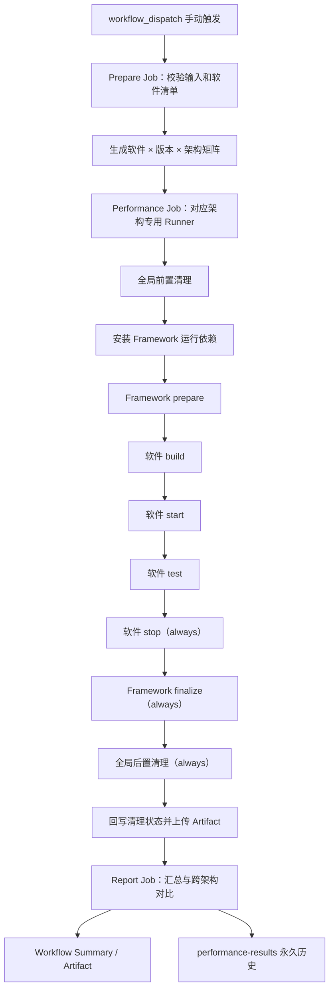

# BoostKit Performance Evaluation

本项目通过一个仅支持手动触发的 GitHub Actions Workflow，在专用裸机 Runner 上对开源软件执行 x86_64 与 aarch64 性能测试。软件清单和测试代码由人工维护，公共 Framework 负责矩阵生成、阶段编排、进程隔离、环境清理、指标校验、跨架构报告和结果持久化。

当前只接入 Redis，支持 `7.4.10`、`8.0.0` 和 `8.0.6`。默认手动运行会把三个版本分别展开到 x86_64 与 aarch64，共生成 6 个性能任务。

## 设计边界

- 唯一触发条件是 `workflow_dispatch`，没有 push、pull request、定时任务或其他自动触发。
- 默认运行全部启用的软件、全部声明版本和两个架构，也支持手动缩小软件、版本或架构范围。
- 性能任务只在带有对应架构标签的专用裸机 Runner 上运行，不使用 Docker 镜像测试。
- 每个软件只实现 build、start、test、stop 四个阶段。
- Framework 统一实现 prepare、finalize、指标提取、报告、环境清理和永久历史。
- 当前不自动生成测试用例，新软件必须人工接入已有测试代码。
- 软件清单不得包含架构和 Runner 标签，标签只在公共配置中维护。
- `config/categories.yaml` 同时维护分类顺序和各分类的软件注册列表，矩阵不会执行未登记目录。

## 手动运行

在 GitHub 仓库的 Actions 页面选择 `Manual performance evaluation`，通过 `Run workflow` 启动。

| 输入 | 默认值 | 用途 |
|---|---|---|
| `software` | `all` | 软件名、逗号分隔的软件名，或全部软件。 |
| `version` | `all` | 版本、逗号分隔的版本，或全部声明版本。 |
| `architecture` | `all` | `all`、`x86_64` 或 `aarch64`；`all` 默认运行两个架构。 |
| `update_baseline` | `false` | 是否用本次成功的双架构结果更新 `baseline.json`。 |

`update_baseline=true` 时必须选择 `architecture=all`。只有两个架构的测试和后置清理全部成功，才允许更新基线。

仓库使用固定并发组 `dedicated-performance-runners`，新的手动运行不会取消正在执行的性能任务。

## Workflow 执行流程



### Prepare Job

Prepare Job 在 `ubuntu-latest` 上执行，不占用性能 Runner：

1. 校验 Baseline 更新范围。
2. 从默认 PyPI 安装固定版本的 PyYAML，不为 Ubuntu 配置镜像站。
3. 使用 `framework/catalog.py matrix` 一次完成全部软件清单校验和矩阵生成。
4. 把矩阵写入 Job 输出和 Workflow Summary。

Catalog 会检查注册表与实际 `case.yaml` 双向一致、目录与清单名称一致、软件名全局唯一、版本非空、四阶段入口声明完整、脚本路径安全且存在、函数名合法、预期输出安全、指标定义完整，以及软件清单中不存在架构或 Runner 标签。登记但缺少 `case.yaml` 或存在未登记用例都会使 Prepare Job 失败。

### Performance Job

矩阵中的每个软件、版本和架构对应一个独立 Job。Workflow 通过 `matrix.runner_label` 选择专用 Runner，并依次调用：

```text
prepare → build → start → test → stop → finalize → cleanup
```

阶段严格串行。Workflow 只向 Framework 传入阶段名；Framework 根据 `case.yaml` 查找该阶段声明的脚本和函数，加载脚本并调用对应函数。当前阶段函数退出且 stdout/stderr 全部转发完毕后，Workflow 才会进入下一步。每个软件阶段的控制台输出同时保存为 `command-<stage>.log`。

| 阶段 | 所属层 | 职责 |
|---|---|---|
| `prepare` | Framework | 校验实际架构、创建运行上下文、采集测试前环境。 |
| `build` | 软件 | 裸机编译、构建校验、实际版本和二进制校验。 |
| `start` | 软件 | 启动被测服务并等待就绪。 |
| `test` | 软件 | 执行性能基准，聚合并写出清单声明的结果文件。 |
| `stop` | 软件 | 幂等停止服务并确认退出；失败路径也执行。 |
| `finalize` | Framework | 采集测试后环境、严格校验输出、提取指标、生成单架构报告。 |
| `cleanup` | Framework | 全局清理 Runner，并把清理结果回写到状态和规范化结果。 |

阶段超时、Workflow 取消或 Runner 收到终止信号时，Framework 会终止整个阶段进程组，而不是只结束外层 Shell。`start` 是唯一允许被测服务保留到下一阶段的入口，服务最终必须由 `stop` 和全局清理共同收口。

### Report Job

Report Job 始终尝试下载全部架构 Artifact，并完成：

- 单架构任务状态和指标汇总；
- 同软件、同版本的 x86_64/aarch64 参数一致性校验；
- 跨架构指标计算和 Markdown 报告；
- JUnit XML；
- Workflow Summary；
- 汇总报告 Artifact；
- 成功任务的永久结果准备和发布。

Report Job 不解析 YAML，因此不安装 PyYAML。

## Runner 配置

Runner 标签只在 `config/defaults.yaml` 中维护：

| 架构 | Runner 标签 |
|---|---|
| `x86_64` | `PERF_RUNNER_X86_64` |
| `aarch64` | `PERF_RUNNER_ARM64` |

Workflow 中不硬编码具体标签，也不需要 GitHub Actions Variables。更换 Runner 标签时只修改 `config/defaults.yaml`。

性能 Runner 必须满足：

- 专用裸机，不与普通 CI 或其他业务共享；
- 实际 CPU 架构与 Runner 标签一致；
- 预装 Python 3.11+、pip、Git、编译器和软件清单要求的系统编译依赖；
- 允许测试用户管理 `/tmp/boostkit-perf` 下的全部内容和测试进程；
- 不允许测试期间通过 apt、dnf 或系统级 pip 改写宿主机；
- 所有源码、构建、缓存、数据、临时文件和安装前缀必须进入 `/tmp/boostkit-perf`。

## Python 依赖

项目不使用 `pyproject.toml`、uv 或依赖锁文件。Workflow 直接声明运行依赖：

```text
PyYAML==6.0.2
```

Ubuntu Prepare Job 使用 pip 默认的 PyPI，不配置镜像站。专用 Performance Runner 统一使用阿里云 PyPI 镜像：

```text
https://mirrors.aliyun.com/pypi/simple/
```

Prepare Job 把依赖安装到 `${RUNNER_TEMP}/boostkit-framework-deps`。每个 Performance Job 在全局前置清理后，把依赖安装到 `/tmp/boostkit-perf/framework-deps`，后续全部阶段共同复用，并在全局后置清理时统一删除。依赖不会写入 Runner 的系统 Python。

Prepare 与 Performance 是不同机器上的独立 Job，文件系统不共享，因此各自安装一次。Report Job 不需要该依赖。

## 全局环境清理

清理入口是 `framework/cleanup_environment.sh`，只允许在同时满足以下条件时运行：

- `PERF_DEDICATED_RUNNER=true`；
- `PERF_WORK_ROOT=/tmp/boostkit-perf`；
- 参数为 `--before`、`--after` 或 `--verify`。

前置和后置清理都针对整个 `/tmp/boostkit-perf`，不是只删除本次任务目录：

1. 扫描所有引用工作根目录或带有性能运行隔离标识的进程。
2. 先发送 `SIGTERM`，仍未退出时发送 `SIGKILL`。
3. 查找并卸载工作根目录下的遗留挂载点。
4. 删除工作根目录下的全部源码、构建、安装、缓存、数据、虚拟环境和临时文件。
5. 二次扫描进程、文件和挂载点。
6. 任一残留存在时立即失败，Runner 应停止继续承载性能任务并进入维护。

进程扫描同时检查：

- `PERF_PROCESS_TOKEN` 和 `PERF_WORK_DIR` 环境变量；
- 命令行参数；
- 当前工作目录；
- 可执行文件路径；
- 已打开文件描述符。

因此后台服务即使没有在命令行中显示工作根目录，也能通过进程环境或资源引用被识别。

## 软件接入规范

`config/categories.yaml` 是分类和软件注册的唯一配置源。空分类直接留空，不写 `[]`；Catalog 会在内存中把空值规范化为空列表：

```yaml
categories:
  AI:
  Bigdata:
  Storage:
  Database:
    - redis
  Media:
  HPC:
  Middleware:
  Toolchain:
  Others:
```

同一软件只能登记在一个分类下。矩阵只从这里登记且 `case.yaml` 启用的软件生成，不能通过新增目录绕过注册表。

新增软件使用以下结构，不要求额外创建软件 README：

```text
software/<category>/<software>/
├── case.yaml
├── <software>_test.sh
└── scripts/                 # 仅在需要辅助程序时创建
```

### `case.yaml`

软件清单至少声明：

- 软件名、分类、启用状态和版本列表；
- `execution.type: shell-functions`；
- `execution.stages` 中完整且仅有 build、start、test、stop 四个阶段；
- 每个阶段的 Shell 脚本路径和函数名；
- 超时时间和运行参数；
- 每个输出的逻辑名称、相对路径、生成阶段、格式和必要性；
- 每个指标的来源 JSON、点路径、单位、优化方向和可选目标值。

入口声明示例：

```yaml
execution:
  type: shell-functions
  stages:
    build:
      script: redis_test.sh
      function: build_redis
    start:
      script: redis_test.sh
      function: start_redis_service
    test:
      script: redis_test.sh
      function: run_redis_benchmarks
    stop:
      script: redis_test.sh
      function: stop_redis_service
  timeout_minutes: 180
  environment: {}
outputs:
  aggregate_result:
    path: results.json
    stage: test
    format: json
    required: true
```

阶段可以映射到同一个脚本，也可以映射到软件目录内的不同 `.sh` 文件。脚本路径必须是软件目录内的相对路径，函数名必须是合法的 Shell 标识符。Catalog 负责静态校验声明，Framework 在运行时加载脚本后使用 `declare -F` 确认函数真实存在；缺失函数会立即失败，不能回退到其他阶段或空操作。

`outputs` 是软件交付结果的结构化契约。输出路径必须位于 `RESULTS_DIR` 内且不能重复，`stage` 只能是 build、start、test、stop，`format` 支持 `json`、`text`、`binary`，`required` 必须明确为布尔值。阶段函数成功退出后，Framework 立即验收属于该阶段的输出；JSON 还会检查语法和根节点类型。可选输出不存在时不会失败，但指标来源必须是必要的 JSON 输出。

软件清单禁止声明：

```text
architectures
runner
runner_label
```

所有已登记且启用的软件默认由 Catalog 展开为两个架构；只有手动输入可以缩小执行范围。

### 四阶段函数契约

软件脚本必须为四个阶段各暴露一个职责明确的函数。阶段键固定，函数名不固定，推荐包含软件或服务语义，例如：

```bash
build_redis() { ...; }
start_redis_service() { ...; }
run_redis_benchmarks() { ...; }
stop_redis_service() { ...; }
```

脚本不得在文件末尾根据 `$1` 分发阶段，也不得提供隐式 `all` 或 `run_all` 入口。脚本被 `source` 时只应完成变量初始化和函数定义，不应自动构建、启动服务或执行测试。Framework 的统一调用链如下：

```text
workflow --stage build
  → case.yaml execution.stages.build
  → source 声明的 script
  → 校验声明的 function 存在
  → 调用 build_redis 并原样返回退出码
```

公共 Framework 通过环境变量传入：

- `SOFTWARE_VERSION`：当前测试版本；
- `EXPECTED_ARCH`：期望架构；
- `RESULTS_DIR`：结果输出目录；
- `PERF_RUN_ID`：运行编号；
- `PERF_PROCESS_TOKEN`：进程隔离标识；
- `PERF_WORK_DIR`：本次软件工作目录；
- `TMPDIR`、`PIP_CACHE_DIR`、`XDG_CACHE_HOME`、`CARGO_HOME`、`CCACHE_DIR`：任务私有临时和缓存目录。

软件脚本必须遵守：

- build 包含构建、安装或源码树二进制准备，以及版本、架构和基本功能校验；
- start 必须等待服务真正可用后再正常退出；
- test 只使用本次 start 启动的服务，并生成全部预期输出；
- stop 必须幂等，即使服务没有启动或已经退出也能安全执行；
- 所有阶段必须等待自身工作完成并返回准确退出码；
- 不得使用上一次运行的结果掩盖本次失败；
- 不得在 Workflow 中添加按软件名称判断的分支。

### 当前 Redis 用例

Redis 用例位于 `software/Database/redis`，支持三个版本和一套正式参数。软件脚本保留原始构建命令：

```bash
make -j$(nproc) BUILD_TLS=no
```

构建后直接使用源码树中的 `src/redis-server`、`src/redis-benchmark` 和 `src/redis-cli`，不执行 `make install`，也不额外改写 Redis Make 参数。

当前提取指标：

| 指标 | 单位 | 优化方向 |
|---|---|---|
| `set_qps_c50` | ops/s | 越大越好 |
| `get_qps_c50` | ops/s | 越大越好 |
| `average_latency` | ms | 越小越好 |
| `maximum_p99_latency` | ms | 越小越好 |
| `client_scaling_ratio` | ratio | 越大越好 |

## 结果和指标契约

每个软件阶段必须生成 `case.yaml` 中归属于该阶段的必要输出。Framework 会在阶段结束时立即检查，并在 finalize 再次验收全部结果。以下情况会被拒绝：

- 文件缺失或空文件；
- 非法 JSON；
- JSON 根节点不是对象；
- 指标来源文件不可用；
- 指标点路径不存在；
- 布尔值、字符串、`null` 或其他非数值类型；
- NaN 或 Infinity；
- 最终没有提取到任何指标。

统一指标包含：

```json
{
  "value": 1000,
  "unit": "ops/s",
  "direction": "higher_is_better",
  "target": 1000
}
```

支持的优化方向：

| 值 | 报告说明 |
|---|---|
| `higher_is_better` | 越大越好 |
| `lower_is_better` | 越小越好 |
| `target_is_better` | 越接近目标越好 |
| `neutral` | 仅展示 |

跨架构对比要求两个结果的软件、版本、参数签名、指标集合、单位和优化方向全部一致。越小越好的指标会反向换算相对性能，使“相对性能大于 1”始终表示 aarch64 更优。

单架构报告按 aarch64 和 x86_64 两个小标题分组；单架构指标顺序与跨架构指标顺序保持一致。

## 输出目录和保存策略

单个矩阵任务的仓库工作区输出：

```text
.perf-output/<category>/<software>/<version>/<arch>/<run_id>/
```

主要包含：

```text
environment_before.json
environment_after.json
status.json
normalized_result.json
report.md
command-build.log
command-start.log
command-test.log
command-stop.log
软件声明的原始结果文件
```

`.perf-output/` 只属于本次 Workflow 工作区，不提交到主分支。

结果通过三种方式保存：

| 位置 | 内容 | 保留策略 |
|---|---|---|
| Workflow Summary | 矩阵、任务状态、单架构指标和跨架构对比 | 随 Actions Run 保存 |
| GitHub Actions Artifact | 原始结果、阶段日志、规范化结果和汇总报告 | 架构结果 30 天，汇总报告 90 天 |
| `performance-results` 分支 | 精简最终结果、报告、运行元数据和 Baseline | 永久保存 |

`performance-results` 分支结构：

```text
<category>/<software>/<version>/
├── baseline.json
└── <run_id>-<attempt>/
    ├── manifest.json
    ├── combined-report.md
    ├── x86_64/
    │   ├── normalized_result.json
    │   ├── report.md
    │   └── 软件声明的 JSON 输出
    ├── aarch64/
    │   ├── normalized_result.json
    │   ├── report.md
    │   └── 软件声明的 JSON 输出
    ├── comparison.json
    └── comparison.md
```

每个 `<run_id>-<attempt>` 目录不可覆盖。构建日志、大型原始文件、源码和二进制只保存在限期 Artifact 中，不进入 Git 历史。

`baseline.json` 用于记录人工确认的双架构参考运行，保存来源 Run、提交 SHA、Workflow URL、参数签名和指标。当前 Baseline 只作为可追溯参考，不会自动触发定时测试或自行更新。

## 本地检查

Ubuntu 本地环境直接使用默认 PyPI 安装验证依赖：

```bash
python3 -m pip install \
  "PyYAML==6.0.2" "pytest>=8.0,<9.0"
```

其他环境使用阿里云镜像：

```bash
python3 -m pip install \
  --index-url https://mirrors.aliyun.com/pypi/simple/ \
  "PyYAML==6.0.2" "pytest>=8.0,<9.0"
```

校验软件清单：

```bash
python3 framework/catalog.py validate
```

查看默认双架构矩阵：

```bash
python3 framework/catalog.py matrix \
  --software all \
  --version all \
  --architecture all \
  --pretty
```

运行 Framework 单元测试：

```bash
python3 -m pytest framework/tests
```

`framework/tests` 使用临时目录、假软件入口和短生命周期进程验证公共 Framework，不会编译 Redis、运行正式性能测试或连接性能 Runner。

## 文件职责

本节覆盖版本库内全部正式文件。缓存、运行产物和 Python `__pycache__` 不属于正式实现。

### 根目录与 Workflow

| 文件 | 用途 |
|---|---|
| `README.md` | 项目唯一文档，包含架构、操作、接入规范和全部文件职责。 |
| `.gitignore` | 排除运行产物、缓存、历史结果工作区和本地临时文件。 |
| `.github/workflows/performance-test.yml` | 唯一 Workflow；处理手动输入、矩阵、双架构任务、前后清理、报告和永久历史。 |

### 公共配置

| 文件 | 用途 |
|---|---|
| `config/categories.yaml` | 分类顺序和分类下软件列表的唯一注册表；空值表示当前没有软件。 |
| `config/defaults.yaml` | 默认双架构、架构到 Runner 标签的唯一映射、输出根目录和裸机工作根目录。 |

### Framework

| 文件 | 用途 |
|---|---|
| `framework/catalog.py` | 读取软件注册表，对登记项与实际清单做双向校验，并按手动输入生成执行矩阵。 |
| `framework/context.py` | 定义单个软件、版本、架构任务的不可变运行上下文。 |
| `framework/command_adapter.py` | 解析清单中的阶段入口、注入运行环境、加载脚本并调用声明函数、实时保存日志、等待退出，并在超时或中断时终止进程组。 |
| `framework/run_case.py` | 单任务阶段控制器；编排 prepare/finalize 和软件四阶段，维护任务状态。 |
| `framework/collect_environment.py` | 采集测试前后的 OS、CPU、内存、内核、NUMA 和 CPU governor 信息。 |
| `framework/normalize_results.py` | 严格检查预期文件和指标，并转换成统一指标模型。 |
| `framework/reporting.py` | 生成单架构、跨架构、整次运行 Markdown 和 JUnit XML。 |
| `framework/generate_comparison.py` | 配对双架构结果，校验参数和指标契约，生成汇总与跨架构报告。 |
| `framework/json_helper.py` | JSON 读取、点路径取值、禁止 NaN/Infinity 的原子写入。 |
| `framework/cleanup_environment.sh` | 对专用裸机执行全局前置、后置清理和清洁度验收。 |
| `framework/process_scanner.py` | 扫描 `/proc`，识别带有隔离标识或引用工作根目录的残留进程。 |
| `framework/mark_cleanup.py` | 在依赖目录被清理后，使用标准库把后置清理结果回写到任务结果；清理失败退出码为 80。 |
| `framework/prepare_result_history.py` | 提取精简永久结果，生成不可变历史目录和受控 Baseline。 |
| `framework/publish_result_history.sh` | 把精简结果提交并推送到独立 `performance-results` 分支。 |

### Framework 单元测试

| 文件 | 用途 |
|---|---|
| `framework/tests/conftest.py` | 将脚本式 Framework 模块加入测试导入路径。 |
| `framework/tests/test_cases_and_matrix.py` | 验证软件清单、双架构矩阵、Runner 标签单一来源、Workflow 阶段和精简后的目录结构。 |
| `framework/tests/test_command_adapter.py` | 使用假入口验证显式阶段函数映射、环境变量、退出码、日志、串行等待、超时和进程组终止。 |
| `framework/tests/test_results_and_reports.py` | 验证严格指标提取、跨架构语义、报告排序、清理状态、永久历史和 Baseline 约束。 |

### 软件目录

| 文件或模式 | 用途 |
|---|---|
| `software/README.md` | 说明分类目录和新软件的必要文件结构。 |
| `software/<空分类>/.gitkeep` | 保存尚未接入软件的分类目录。 |
| `software/<category>/<software>/case.yaml` | 声明版本、四阶段脚本与函数映射、正式参数、结构化输出和指标提取契约。 |
| `software/<category>/<software>/<software>_test.sh` | 软件阶段函数实现，为 build、start、test、stop 分别暴露语义清晰的函数，不自行分发执行。 |
| `software/<category>/<software>/scripts/` | 可选的软件私有基准、聚合和辅助程序。 |

### Redis 用例

| 文件 | 用途 |
|---|---|
| `software/Database/redis/case.yaml` | Redis 版本、正式参数、预期输出和指标定义。 |
| `software/Database/redis/redis_test.sh` | Redis 四阶段函数实现，负责构建校验、服务生命周期、测试和软件级结果聚合。 |
| `software/Database/redis/scripts/write_version_info.py` | 记录实际 Redis 版本、架构和运行环境。 |
| `software/Database/redis/scripts/benchmark_redis.py` | 执行 Redis 命令与多并发组合的主性能基准。 |
| `software/Database/redis/scripts/micro_benchmark.py` | 执行数据大小、客户端并发和持久化模式微基准。 |
| `software/Database/redis/scripts/aggregate_results.py` | 聚合原始结果并计算 QPS、延迟和客户端扩展指标。 |

## 新软件接入检查表

1. 在 `config/categories.yaml` 的目标分类下登记软件名。
2. 创建对应的软件目录并人工编写 `case.yaml`，不得写入架构或 Runner 标签。
3. 在 `case.yaml` 显式声明四阶段的脚本和函数，并在脚本中实现 build、start、test、stop。
4. 确保所有临时资源进入 `PERF_WORK_DIR` 或公共工作根目录。
5. 为每个输出声明路径、生成阶段、格式和必要性，并确保对应阶段生成全部必要输出。
6. 确保 stop 可重复执行，并能处理部分启动或失败状态。
7. 运行 Catalog 校验、矩阵检查和 Framework 单元测试。
8. 先手动运行单版本、单架构任务，稳定后再运行默认双架构矩阵。

测试用例生成、自动触发、趋势页面和新的结果门禁不属于当前实现范围，增加前必须单独评审。
