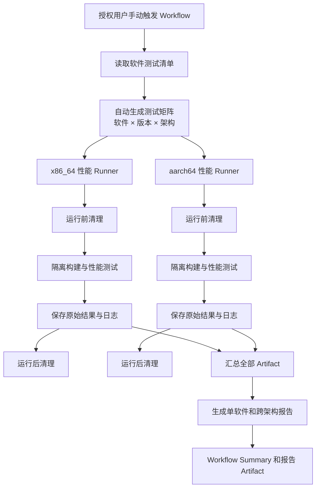

# 性能测试 Workflow 自动化实施方案

## 1. 建设目标

将现有 openEuler ARM64 性能测试脚本改造为一套可在 GitHub Actions 中自动运行的性能测试流水线，实现：

1. 复用当前已有测试用例，通过手工维护的软件清单生成执行矩阵；当前阶段不自动生成测试代码。
2. 在 x86_64 和 aarch64 两种架构上执行相同的软件性能测试。
3. 每次测试前后对专用 Runner 执行全局环境净化与验收。
4. 生成单架构测试报告和跨架构对比报告。
5. 仅支持由授权用户手动触发，不配置任何自动触发条件。

## 2. 总体架构



核心设计原则：

- 测试定义声明化，Workflow 不硬编码软件列表。
- x86_64 和 aarch64 使用同一份用例参数和基准实现。
- 只在专用裸机 Runner 上源码编译安装，所有任务产物进入统一工作根目录。
- 测试失败、取消或超时后仍然执行清理和日志上传。
- 原始性能结果和汇总报告分离保存。
- 性能 Workflow 仅允许具备仓库 Actions 执行权限的授权用户手动启动。

## 3. 建议目录结构

```text
./
├── README.md
├── pyproject.toml
├── .gitignore
├── software/
│   ├── AI/
│   │   └── <software>/
│   │       ├── case.yaml
│   │       ├── <software>_test.sh  # 复用当前已有主入口
│   │       ├── adapter.py          # 保留扩展位，当前 Workflow 不加载
│   │       ├── scripts/            # 复用当前已有辅助脚本和基准
│   │       │   ├── benchmark_*.py
│   │       │   ├── micro_benchmark.py
│   │       │   ├── aggregate_results.py
│   │       │   ├── generate_summary.py
│   │       │   ├── json_helper.py
│   │       │   └── native/         # 可选：已有原生基准源码
│   │       ├── fixtures/           # 可选：小型静态输入和配置模板
│   │       └── README.md
│   ├── Bigdata/
│   ├── Storage/
│   ├── Database/
│   ├── Media/
│   ├── HPC/
│   ├── Middleware/
│   ├── Toolchain/
│   └── Others/
├── framework/
│   ├── adapter_base.py
│   ├── command_adapter.py
│   ├── context.py
│   ├── generate_matrix.py
│   ├── validate_case.py
│   ├── run_case.py
│   ├── collect_environment.py
│   ├── cleanup_environment.sh
│   ├── process_scanner.py
│   ├── mark_cleanup.py
│   ├── aggregate_results.py
│   ├── generate_comparison.py
│   ├── json_helper.py
│   ├── reporting/
│   │   ├── single_report.py
│   │   ├── comparison_report.py
│   │   ├── summary_report.py
│   │   └── junit_report.py
│   ├── schemas/
│   │   ├── case.schema.json
│   │   ├── result.schema.json
│   │   ├── environment.schema.json
│   │   └── status.schema.json
│   └── verification/
│       ├── conftest.py
│       ├── test_cases_and_matrix.py
│       ├── test_command_adapter.py
│       └── test_results_and_reports.py
├── config/
│   ├── categories.yaml
│   └── defaults.yaml
├── baselines/
│   └── <category>/<software>/<version>/<arch>.json
├── .github/
│   └── workflows/
│       └── performance-test.yml
└── .perf-output/                   # 本地测试结果，加入 .gitignore
```

所有分类下的软件目录采用与示例 `software/AI/<software>/` 相同的内部结构。现有软件的 Python、Shell 和 C++ 基准实现可以逐步迁移至 `software/<category>/<software>/`。同一软件的清单、现有入口、辅助脚本和说明放在同一个目录。第一版保留当前 `<software>_test.sh + scripts/` 结构，不要求先重写测试用例。

### 3.1 根目录文件

| 文件 | 用途 | 设计要求 |
|---|---|---|
| `README.md` | 项目总入口，说明如何接入已有软件用例、手动启动 Workflow、读取报告和排查失败。 | 只描述稳定入口，不复制每个软件的具体参数。软件私有说明放在软件自己的 README。 |
| `pyproject.toml` | 声明公共框架的 Python 版本、依赖以及格式化和测试配置。 | 专用裸机预装 Python 3.11+ 与 PyYAML 6.x；软件运行依赖仍由各自 `case.yaml` 声明。 |
| `.gitignore` | 忽略 `.perf-output/`、venv、Python 缓存、构建目录和临时报告。 | 不忽略软件清单、基线和用于复现的小型 fixtures。 |

### 3.2 `software/`：软件用例实现

`software/` 仅保存软件私有内容，一级目录固定为：`AI`、`Bigdata`、`Storage`、`Database`、`Media`、`HPC`、`Middleware`、`Toolchain`、`Others`。

一个软件只能拥有一个主分类，避免同一套测试代码被复制到多个分类。跨领域属性通过 `case.yaml` 中的 `tags` 表达。

#### `software/<category>/<software>/case.yaml`

该文件是单个软件测试的唯一配置源，负责声明：

- 软件名称、主分类、标签和启用状态。
- 需要测试的软件版本。
- 裸机源码编译、安装前缀和构建参数。
- 当前已有 `<software>_test.sh` 入口及预期结果文件。
- `staged` 分阶段命令接口。
- 唯一一套正式测试参数。
- 超时、预热次数、正式迭代次数和随机种子。
- 每个架构的绝对性能阈值。
- 每项指标的单位和优化方向。
- 外部数据集地址、版本、校验和及本地缓存策略。

`case.yaml` 不保存 Runner 标签，也不决定默认架构。默认双架构由公共矩阵生成器控制，Runner 标签只在公共 Workflow 中统一映射。

#### `software/<category>/<software>/<software>_test.sh`

这是当前已有测试用例的主入口，第一阶段直接复用。公共框架通过 `case.yaml` 将软件版本、架构、输出目录和运行编号传给该脚本，并以阶段名调用。入口必须提供以下阶段函数：

| 阶段参数 | 软件函数职责 |
|---|---|
| `build` | 裸机编译并安装到任务专属前缀。 |
| `validate` | 校验架构、实际版本、安装文件和核心功能。 |
| `start-service` | 启动被测服务并等待就绪。 |
| `test` | 复用已启动服务执行主基准和微基准。 |
| `stop-service` | 幂等停止服务，Workflow 使用 `if: always()` 调用。 |
| `collect-report` | 聚合软件原始结果并检查输出完整性。 |

只做以下必要兼容改造：

- 接收框架指定的输出目录。
- 支持 x86_64 和 aarch64，不再固定断言 ARM64。
- 将实际安装版本写入结果并与请求版本核对。
- 正确返回退出码，不使用旧结果掩盖本次失败。
- 将软件私有临时文件限制在本次 workspace。

主入口保留现有构建、校验、测试和报告函数实现；Workflow 只负责按阶段调用，不重新实现软件逻辑。

#### `software/<category>/<software>/adapter.py`（保留接口）

`adapter_base.py` 仅保留为未来扩展定义，当前正式 Workflow 不加载软件专用 `adapter.py`。所有已启用软件必须实现 `staged command` 接口，避免 Workflow 出现按软件名称选择执行方式的分支。

#### `software/<category>/<software>/scripts/`

该目录直接接收现有软件的辅助脚本，第一阶段不统一重命名。常见文件职责如下：

| 文件 | 用途 | 当前阶段处理方式 |
|---|---|---|
| `benchmark_*.py` | 已有主性能基准，例如 ANN、压缩、序列化、文件系统或通用计算。 | 保留现有名称和实现，只补充统一输出路径、架构参数和错误返回。 |
| `micro_benchmark.py` | 已有微基准，测量核心操作延迟、吞吐和线程扩展。 | 保留现有实现，统一结果字段和参数签名。 |
| `aggregate_results.py` | 已有软件级结果聚合器。 | 第一阶段继续使用；随后由公共聚合器校验并包装其输出。 |
| `generate_summary.py` | 已有文本报告生成器。 | 保留软件报告；全局和跨架构报告由公共 reporting 生成。 |
| `json_helper.py` | 已有 Shell 与 JSON 之间的辅助工具。 | 第一阶段保留，流程稳定后再评估是否迁移到公共 `framework/json_helper.py`。 |
| `native/` | 已有 C/C++、Rust、Java 等原生基准源码。 | 只迁移源码和构建文件，不迁移编译产物。 |

不同软件没有某个文件时不需要创建空文件。公共框架根据 `case.yaml` 中声明的预期输出判断本次用例是否完整。

#### `fixtures/`

保存可提交仓库的小型固定输入、配置模板、SQL、Proto 或期望输出。大型数据集不得提交到这里，应在 `case.yaml` 中记录不可变下载地址和校验和。

#### 软件 `README.md`

说明该软件为什么选择当前基准、参数含义、数据集来源、支持版本、指标解释、已知限制和本地调试方式。它不参与矩阵生成。

### 3.3 `framework/`：公共执行框架

| 文件 | 用途 | 关键设计 |
|---|---|---|
| `adapter_base.py` | 保留未来扩展所需的接口、返回类型和阶段异常定义。 | 当前正式 Workflow 不加载软件专用适配器。 |
| `command_adapter.py` | 将公共 context 和阶段名转换为环境变量与命令行，调用已有 `<software>_test.sh`。 | 实时输出并保存独立阶段日志；等待主进程和输出转发结束；超时或中断终止整个子进程组；`collect-report` 检查全部预期输出。 |
| `context.py` | 定义一次任务的只读上下文。 | 包含软件、版本、架构、路径、参数、运行编号和日志器；避免通过全局环境变量传递状态。 |
| `generate_matrix.py` | 递归发现 `software/*/*/case.yaml`，按手动输入展开矩阵。 | 默认展开两个架构；指定架构时才过滤；输出稳定、可排序的 JSON。 |
| `validate_case.py` | 使用 Schema 校验清单，并检查目录、适配器、版本和指标定义的一致性。 | 任何校验失败都发生在占用性能 Runner 之前。 |
| `run_case.py` | 单个矩阵任务的阶段控制入口。 | 响应 prepare/build/validate/start-service/test/stop-service/collect-report，持续更新 `status.json`。 |
| `collect_environment.py` | 在测试前后采集真实软硬件环境。 | 采集 CPU、NUMA、内存、内核、OS、频率、governor、编译器和关键依赖。 |
| `cleanup_environment.sh` | 对专用 Runner 执行全局净化和净化后验收。 | 支持 `--before`、`--after`、`--verify`；清理失败必须阻止测试或将最终任务标记失败。 |
| `aggregate_results.py` | 合并环境、主基准、微基准和阶段状态。 | 只聚合相同软件、版本、架构、参数签名和运行编号的数据。 |
| `generate_comparison.py` | 配对 x86_64 与 aarch64 结果并计算比值。 | 根据指标方向选择比较公式，禁止比较参数签名不同的结果。 |
| `json_helper.py` | 提供稳定的 JSON 读取、字段检查、Schema 校验和原子写入。 | 避免各软件重复实现 JSON Shell 辅助函数。写文件采用临时文件加原子替换。 |

Workflow 对 `run_case.py` 的调用顺序：

```text
prepare：加载并校验 case.yaml、创建 context、校验架构、采集运行前环境
→ build：调用软件构建函数
→ validate：调用软件安装校验函数
→ start-service：调用软件服务启动函数
→ test：调用软件测试函数
→ stop-service：无条件调用软件服务停止函数
→ collect-report：调用软件报告函数、检查输出、采集运行后环境并标准化
```

同一矩阵 Job 内的阶段严格串行。`run_case.py` 只有在阶段脚本退出且 stdout/stderr 已完整转发后才返回；GitHub Actions 随后才启动下一步。`start-service` 是唯一允许保留后台进程的阶段，它必须先通过就绪检查，并由 `stop-service` 在 `always()` 路径中停止和验收。

Runner 全局净化位于 `run_case.py` 外层，由 Workflow 负责，完整边界为：

```text
运行前全局净化及验收
→ 分阶段调用 run_case.py
→ 运行后全局净化及验收（if: always）
→ 回写清理状态
→ 上传所需 Artifact（if: always）
```

运行后全局净化不能只依赖 Python 的 `finally`，因为进程被强制终止时 `finally` 不一定执行。

#### `framework/reporting/`

| 文件 | 用途 |
|---|---|
| `single_report.py` | 为一个软件、版本和架构生成 JSON/Markdown 文本报告。 |
| `comparison_report.py` | 生成同软件同版本的双架构对比表，并展示每个指标是越大越好、越小越好还是目标值优先。 |
| `summary_report.py` | 汇总全部分类和软件的成功、失败、跳过、性能告警和清理状态。 |
| `junit_report.py` | 将阶段状态和断言转换为 JUnit XML，供 GitHub Actions 展示。 |

#### `framework/schemas/`

| 文件 | 用途 |
|---|---|
| `case.schema.json` | 约束软件清单结构、枚举值、参数类型、阈值和指标方向。 |
| `result.schema.json` | 约束主基准、微基准和聚合结果的公共字段。 |
| `environment.schema.json` | 约束测试前后环境快照字段和类型。 |
| `status.schema.json` | 约束阶段状态、退出码、失败阶段和清理状态。 |

### 3.4 `config/`：公共配置

| 文件 | 用途 | 设计要求 |
|---|---|---|
| `categories.yaml` | 定义允许使用的分类名称和展示顺序。 | 分类固定为 AI、Bigdata、Storage、Database、Media、HPC、Middleware、Toolchain、Others；清单中的 category 必须命中该文件。 |
| `defaults.yaml` | 定义所有软件共享的默认值。 | 包括默认双架构、架构到 Runner 标签的唯一映射和公共路径；不保存机器地址。 |

### 3.5 `baselines/`：受控性能基线

基线文件路径为：

```text
baselines/<category>/<software>/<version>/<arch>.json
```

每个基线文件保存参数签名、硬件指纹、指标中位数、样本数量、生成任务和审核信息。只有手动触发并显式设置 `update_baseline=true` 的成功任务才能生成候选基线；是否写回仓库需要单独审核。

### 3.6 `framework/verification/`：公共框架验证

| 文件 | 用途 |
|---|---|
| `conftest.py` | 将脚本式公共框架加入验证代码的导入路径。 |
| `test_cases_and_matrix.py` | 验证 Redis 清单、默认双架构矩阵、手动范围过滤和 Workflow 标签单一来源。 |
| `test_command_adapter.py` | 使用假 Shell 入口验证共享任务 venv、阶段参数、环境传递、日志和预期结果检查。 |
| `test_results_and_reports.py` | 验证旧结果规范化、清理状态、失败结果和跨架构指标方向。 |

### 3.7 `.github/workflows/performance-test.yml`

这是唯一 Workflow 文件，并且只声明 `workflow_dispatch`。它负责：

1. 校验手动输入。
2. 安装锁定的公共框架依赖。
3. 校验软件清单并生成动态矩阵。
4. 将矩阵任务分配到对应架构 Runner。
5. 在清理前上传原始日志和结果。
6. 无条件执行运行后全局净化。
7. 下载全部 Artifact 并生成汇总报告。

Workflow 不包含软件专用安装和测试命令，这些逻辑只能存在于软件适配器中。

### 3.8 `.perf-output/`：本地和任务输出

该目录只保存运行时产物，不提交 Git。按以下结构隔离：

```text
.perf-output/<category>/<software>/<version>/<arch>/<run_id>/
```

目录内包含环境快照、主基准、微基准、聚合结果、状态、日志和报告。Workflow 上传 Artifact 后，全局清理可以删除 Runner 上的本地副本。

## 4. 测试用例接入

当前已将 Redis 作为首个人工维护用例接入 `Database` 分类。当前阶段不设计、不实现测试用例自动生成器，也不根据软件名称生成 `adapter.py`、主基准或微基准。先用 Redis 跑通手动触发、双架构执行、全局清理、结果上传和报告链路，再接入其他真实软件。

用例接入原则：

1. `case.yaml` 由维护人员手工编写和审核。
2. 公共 `command_adapter.py` 使用固定阶段名调用现有入口；Workflow 不调用软件私有命令。
3. 现有主基准和微基准逻辑尽量保持不变，只处理双架构、路径、参数和输出格式兼容。
4. 公共框架不根据软件名称生成或修改软件代码。
5. 流程跑通前不创建 `templates/`，也不提供脚手架命令。
6. “动态矩阵生成”只生成 Workflow 执行任务，不生成测试用例文件。

### 4.1 软件测试清单

为每个待接入软件手工增加一个 YAML 清单，声明版本、构建方式、执行入口、运行参数和性能阈值。架构列表和 Runner 不属于软件属性，因此不写入软件清单。结构如下：

```yaml
name: "<software>"
enabled: true
category: "<category>"

versions:
  - "<version>"

execution:
  type: command
  interface: staged
  entrypoint: ./<software>_test.sh
  timeout_minutes: 180
  environment:
    ITERATIONS: 3
    DATA_SCALE: 100K
    RANDOM_SEED: 42
  expected_outputs:
    - version_info.json
    - benchmark_primary.json
    - micro_benchmark.json
    - results.json

metrics:
  throughput:
    source: results.json
    path: summary.throughput
    unit: ops/s
    direction: higher_is_better
  latency:
    source: results.json
    path: summary.latency
    unit: ms
    direction: lower_is_better
```

清单至少描述：

- 软件名称和是否启用。
- 需要测试的版本列表。
- 当前已有测试入口、分阶段接口、正式参数、超时和预期结果文件。
- 数据规模、迭代次数、线程数和随机种子。
- 每种架构独立的性能阈值。
- 超时时间。

软件清单默认不允许配置 `architectures` 或 `runner`。所有启用的软件默认、无条件展开为 `x86_64` 和 `aarch64` 两个任务。只有手动触发时，用户才能通过 `architecture` 输入缩小执行范围。

### 4.2 分阶段命令接入方式

公共 `command_adapter.py` 完成公共框架与人工接入用例之间的阶段、参数和结果转换：

```text
公共 context
→ 转换为现有脚本参数、环境变量和阶段名
→ 逐次调用 build/validate/start-service/test/stop-service/collect-report
→ 收集已有 JSON 和日志
→ 转换并校验为统一结果格式
```

必须优先改造的兼容点：

- 删除仅允许 aarch64 的硬断言，改为校验矩阵期望架构。
- 结果目录由固定版本路径改为框架传入的架构隔离路径。
- 软件版本必须读取并核对实际安装版本。
- 现有脚本不得在宿主机执行不可恢复的系统级安装。
- 测试参数由 `context` 传入，保留现有默认值作为本地调试后备。
- 原始结果继续保留，同时生成符合统一 Schema 的标准结果。
- 软件私有服务和进程由现有入口的 `stop-service` 阶段清理，Runner 全局环境由公共清理脚本处理。

### 4.3 执行矩阵生成

`generate_matrix.py` 递归扫描 `software/*/*/case.yaml`，读取所有启用的软件清单，并使用 Workflow 级常量将每个软件版本默认展开为两个架构：

```python
DEFAULT_ARCHITECTURES = ("x86_64", "aarch64")
```

动态矩阵包含用例属性，以及从公共配置解析出的 `runner_label`；软件清单不包含 Runner 标签：

```json
{
  "include": [
    {
      "software": "<software>",
      "version": "<version>",
      "arch": "x86_64",
      "runner_label": "PERF_RUNNER_X86_64"
    },
    {
      "software": "<software>",
      "version": "<version>",
      "arch": "aarch64",
      "runner_label": "PERF_RUNNER_ARM64"
    }
  ]
}
```

这里的自动化范围仅包括：

- 软件、版本和架构组合。
- 测试参数和结果路径。
- 功能验收和性能门槛。
- Workflow 执行矩阵。
- 单软件与跨架构报告条目。

以下内容当前阶段明确不自动生成：

- `case.yaml`。
- `adapter.py`。
- `<software>_test.sh`。
- `scripts/` 下的主基准、微基准和辅助脚本。
- 软件 README 和 fixtures。

这些文件由维护人员从真实测试代码接入并持续维护。待人工接入流程稳定后，再单独评审测试用例模板和脚手架设计。

架构到 Runner 的映射只在 `config/defaults.yaml` 中管理：

```text
x86_64  -> PERF_RUNNER_X86_64
aarch64 -> PERF_RUNNER_ARM64
```

矩阵生成器根据 `arch` 写入 `runner_label`，Workflow 直接消费该字段。替换机器时将新 Runner 注册为相同标签即可，不修改任何软件清单。

## 5. 手动触发

正式方案只保留 GitHub Actions `workflow_dispatch`。不配置 `pull_request`、`push`、`schedule`、`release` 或其他自动触发事件，代码提交、合并和定时条件均不会自动启动性能任务。

只有具备仓库 Actions 执行权限的授权用户才能在 GitHub Actions 页面选择参数并启动 `performance-test.yml`：

```yaml
on:
  workflow_dispatch:
    inputs:
      software:
        description: "软件名称，all 表示全部"
        default: "all"
        required: true
      version:
        description: "软件版本，all 表示清单中的全部版本"
        default: "all"
        required: true
      architecture:
        description: "执行架构"
        type: choice
        options:
          - all
          - x86_64
          - aarch64
        default: all
      update_baseline:
        description: "是否更新性能基线"
        type: boolean
        default: false
```

参数展开规则：

| 输入 | 执行范围 |
|---|---|
| 默认值 | 全部启用软件 × 全部配置版本 × x86_64/aarch64 |
| 指定软件，版本为 `all` | 指定软件全部配置版本；架构默认仍为两个 |
| 指定软件和版本 | 指定软件版本；架构默认仍为两个 |
| `architecture=x86_64` | 只运行 x86_64，适用于补跑 |
| `architecture=aarch64` | 只运行 aarch64，适用于补跑 |
| `update_baseline=true` | 成功后进入受控基线更新步骤 |

手动触发主要用于：

- 补跑失败的单架构任务。
- 验证指定软件的新版本。
- Runner 故障恢复后的重新执行。
- 人工发起全量双架构测试。
- 经授权更新性能基线。

Workflow 启动后仍会自动完成清单校验、矩阵生成、双架构任务执行、结果汇总、报告生成和全局环境清理；“仅手动触发”只限制任务的启动方式，不影响任务内部自动化流程。

## 6. Runner 设计

### 6.1 Runner 标签

建议为两个架构配置独立的自托管性能 Runner：

```text
x86_64 Runner:
  self-hosted
  linux
  perf
  x64
  PERF_RUNNER_X86_64

aarch64 Runner:
  self-hosted
  linux
  perf
  arm64
  PERF_RUNNER_ARM64
```

Runner 标签不进入软件清单，只由公共配置解析后进入动态矩阵。Workflow 不重复保存标签：

```yaml
runs-on:
  - self-hosted
  - ${{ matrix.runner_label }}
```

无需配置仓库变量。修改标签时只改 `config/defaults.yaml`；替换机器但保留标签时无需修改代码。

### 6.2 性能 Runner 要求

- 每台性能机器同一时间只运行一个正式性能任务。
- 不与普通编译、发布任务共享 CPU。
- 记录 CPU 型号、核心数、频率、NUMA、内存和内核信息。
- 记录 CPU governor、编译器和构建工具版本。
- 显式指定线程数，不依赖不同机器的默认核数。
- x86_64 和 aarch64 尽量使用相同版本的 openEuler、编译器和依赖。
- Runner 必须为固定的专用裸机，使用专属工作目录和独占任务隔离。

同一性能资源上的任务不应相互取消：

```yaml
concurrency:
  group: performance-${{ matrix.arch }}
  cancel-in-progress: false
```

## 7. 统一执行生命周期

所有软件通过统一入口执行：

```bash
python3 framework/run_case.py \
  --case software/<category>/<software>/case.yaml \
  --version <version> \
  --architecture aarch64 \
  --run-id "${GITHUB_RUN_ID}-${GITHUB_RUN_ATTEMPT}" \
  --stage build
```

标准生命周期：

```text
validate-inputs
  → pre-clean
  → prepare-and-collect-environment-before
  → build-and-install
  → validate-installation
  → start-service
  → execute-performance-tests
  → stop-service (always)
  → collect-and-normalize-report (always)
  → post-clean (always)
  → record-cleanup-status (always)
  → upload-artifact (always)
```

建议统一退出码：

| 退出码 | 含义 |
|---:|---|
| 0 | 全部成功 |
| 10 | 清单或参数错误 |
| 20 | 环境准备失败 |
| 30 | 软件构建失败 |
| 40 | 功能验证失败 |
| 50 | 基准执行失败 |
| 60 | 结果格式错误 |
| 70 | 性能阈值未通过 |
| 80 | 环境清理失败 |

## 8. 运行前清理

正式性能测试必须运行在固定的专用裸机 Runner 上，不允许与研发、构建或发布任务共享宿主机。Runner 必须在全局独占锁下执行“全局净化”，而不是只清理带有本次任务标识的资源。每次运行仍生成资源标识用于日志追踪，但它不是清理范围的边界：

```text
RUN_KEY=<run_id>-<attempt>-<software>-<version>-<arch>
```

所有源码目录、安装前缀、临时目录和进程应关联该标识，便于定位来源；全局净化仍会处理该专用 Runner 统一工作根目录下的全部遗留资源。

运行前执行：

1. 获取该 Runner 的全局独占锁；获取失败则禁止开始性能测试。
2. 终止上一次测试遗留的基准、编译和被测服务进程。
3. 检查并卸载统一工作根目录下的遗留挂载点。
4. 删除统一工作根目录下的历史 workspace、venv、源码、安装前缀、数据和构建目录。
5. 检查磁盘、内存、CPU、端口占用、进程和挂载状态。
6. 创建本次运行专属的全新源码、构建、安装、数据和结果目录。
7. 记录全局清理结果与运行前环境快照。

裸机系统编译依赖必须由管理员在 Runner 纳管阶段预装和锁定。正式测试不得通过 `sudo apt/dnf` 或系统级 `pip` 临时修改宿主机；被测软件通过源码编译，并使用 `/tmp/boostkit-perf/<run>/install` 作为安装前缀，以便全局清理可靠恢复环境。

清理后执行环境验收。以下任一条件不满足时，任务直接失败并将 Runner 标记为需要维护，不得带着脏环境继续测试：

- 不存在上一次任务的 workspace、venv、源码、安装、数据和构建目录。
- 不存在已知基准、编译或被测服务残留进程。
- 不存在测试挂载点和测试端口占用。
- 磁盘、内存和系统负载满足基准启动条件。

## 9. 运行后清理

执行顺序必须是：

```text
测试结束
→ 聚合现有结果
→ 上传日志和 Artifact
→ 执行清理
```

Workflow 中上传和清理步骤均使用 `if: always()`：

```yaml
- name: Upload results
  if: always()
  uses: actions/upload-artifact@v4

- name: Cleanup environment
  if: always()
  run: framework/cleanup_environment.sh --global
```

运行后清理：

- 删除统一测试工作根目录下的全部 workspace、venv、源码、安装前缀、数据和构建产物。
- 终止全部遗留的基准、编译和被测服务进程。
- 卸载全部测试挂载点并释放测试端口。
- 再次执行与运行前相同的环境验收。
- 将全局清理及验收状态写入 `status.json`。
- 清理或验收失败时将本次任务标记失败，并停止向该 Runner 分配后续性能任务。

固定裸机 Runner 的全局清理必须配合清理后验收和失败隔离机制；验收失败的机器不得继续接收性能任务，需由管理员恢复到受控初始状态。

## 10. 测试一致性要求

x86_64 和 aarch64 必须保持：

- 软件版本一致。
- 数据集和数据规模一致。
- 随机种子一致。
- 预热次数和正式迭代次数一致。
- 编译优化级别一致。
- OS、系统依赖和构建工具版本尽量一致。
- 线程数策略一致。
- 测试超时策略一致。

报告同时记录：

- 实际架构。
- CPU 型号、核心数和频率。
- 内存容量。
- OS 和内核版本。
- 编译器、Python 和关键依赖版本。
- 编译器、链接器、构建参数和安装前缀。
- 冷启动或预热测试模式。

跨架构报告展示原始数据和比值，但不得脱离硬件配置直接宣称某个架构整体优于另一个架构。

## 11. 结果目录与数据格式

双架构并行执行后，结果路径必须包含架构和运行编号：

```text
.perf-output/
└── <category>/
    └── <software>/
        └── <version>/
            ├── x86_64/
            │   └── <run_id>/
            └── aarch64/
                └── <run_id>/
```

每个任务至少输出：

```text
version_info.json
environment_before.json
environment_after.json
benchmark_primary.json
micro_benchmark.json
results.json
results.txt
results.log
status.json
```

`status.json` 示例：

```json
{
  "software": "<software>",
  "version": "<version>",
  "architecture": "aarch64",
  "status": "passed",
  "failed_stage": null,
  "cleanup_status": "passed"
}
```

所有 JSON 使用 `result.schema.json` 统一校验。

## 12. 报告设计

### 12.1 单次任务报告

单次报告展示：

- 软件、版本和架构。
- 运行环境和构建信息。
- 主基准结果。
- 微基准结果。
- 性能阈值及判定。
- 功能测试状态。
- 清理状态。
- 原始日志位置。

### 12.2 跨架构对比报告

每个指标在结果 Schema 和软件清单中必须带有单位和优化方向：

```yaml
metrics:
  qps:
    unit: queries/s
    direction: higher_is_better
  latency_us:
    unit: us
    direction: lower_is_better
  fidelity:
    unit: ratio
    direction: target_is_better
    target: 1.0
```

允许的优化方向包括：

| direction | 报告说明 | 典型指标 |
|---|---|---|
| `higher_is_better` | 越大越好 | QPS、吞吐量、Recall、压缩速度、扩展比 |
| `lower_is_better` | 越小越好 | 延迟、耗时、内存占用、文件大小 |
| `target_is_better` | 越接近目标值越好 | Fidelity、误差率目标区间 |
| `neutral` | 仅展示，不参与优劣判定 | CPU 核数、样本数量、软件版本 |

相同软件、版本和测试参数的数据配对后，生成 x86_64/aarch64 对比。报告必须显示“优化方向”，不能让读者自行猜测指标含义：

| 指标 | 优化方向 | x86_64 | aarch64 | ARM/x86 原始比值 | 相对性能 | 判定 |
|---|---|---:|---:|---:|---:|---|
| QPS | 越大越好 | 50000 | 46000 | 0.92 | 0.92 | 通过 |
| Recall@10 | 越大越好 | 0.96 | 0.96 | 1.00 | 1.00 | 一致 |
| 延迟 | 越小越好 | 20 μs | 22 μs | 1.10 | 0.91 | 通过 |
| 构建时间 | 越小越好 | 12 s | 15 s | 1.25 | 0.80 | 关注 |

对于越大越好的指标：

```text
ARM/x86 = aarch64 指标 / x86_64 指标
```

对于越小越好的延迟指标：

```text
ARM/x86 原始比值 = aarch64 指标 / x86_64 指标
相对性能 = x86_64 指标 / aarch64 指标
```

“相对性能”统一约定为大于 1 表示 aarch64 更优，小于 1 表示 x86_64 更优。`target_is_better` 指标使用与目标值的偏差进行判定，不直接用原始比值判断优劣。报告底部必须重复展示该图例。

### 12.3 全局汇总报告

汇总报告包括：

- 软件和测试组合总数。
- 成功、失败和跳过数量。
- 两个架构各自的执行状态。
- 性能阈值未通过的软件。
- 相对基线发生回退的软件。
- 结果缺失和清理失败的软件。
- 各任务 Artifact 链接。

输出格式：

```text
combined-report.json
combined-report.md
junit.xml
```

第一阶段通过 GitHub Workflow Summary 展示 Markdown 报告，并将完整结果作为 Artifact 保存。HTML 或历史趋势页面在主流程稳定后再建设。

## 13. Workflow Job 设计

只保留一个由 `workflow_dispatch` 启动的 `performance-test.yml`：

```text
validate-inputs
  → validate-manifests
  → generate-matrix
  → performance-test（prepare/build/validate/start/test/stop/collect/cleanup 动态矩阵）
  → aggregate-report
  → publish-summary
```

关键要求：

- `performance-test` 根据矩阵选择 x86_64 或 aarch64 Runner。
- 每个阶段通过 `run_case.py --stage <name>` 调用软件入口中的对应函数。
- `stop-service`、`collect-report`、运行后清理和 Artifact 上传使用 `if: always()`。
- 所有矩阵任务固定使用软件清单中的唯一一套正式参数。
- 单个测试失败不阻止其他矩阵任务运行。
- `aggregate-report` 使用 `if: always()`，即使部分任务失败也生成报告。
- 日志和已有结果在清理前上传。
- 执行范围完全由手动输入参数决定，不分析 Git 变更，也不响应代码提交事件。

## 14. 现有脚本改造项

1. 将固定 ARM64 断言改为校验“实际架构等于矩阵期望架构”。
2. 从实际系统采集架构、OS、CPU 和硬件信息。
3. 结果目录增加软件、版本、架构和运行编号。
4. 将准备、构建、测试、报告和清理拆成可独立调用阶段。
5. 避免向 Runner 的系统 Python 直接安装依赖。
6. 通过清单读取参数和架构独立阈值。
7. 为所有随机数据固定随机种子。
8. 统一预热次数和正式迭代次数定义。
9. 统一 JSON Schema 和错误返回码。
10. 将服务停止、报告收集和全局清理放入 Workflow 的 `always()` 路径。
11. 将现有断言结果输出为统一状态 JSON 或 JUnit XML。
12. Workflow 统一编排生命周期，软件脚本保留各阶段的具体实现。

## 15. 性能门槛和基线

每个架构独立配置绝对性能门槛，不能默认使用同一数值。

正式流程支持两种判定：

- 绝对门槛：例如 QPS 不低于配置值、延迟不高于配置值。
- 相对基线：与同架构、同软件、同版本和同参数的稳定基线比较。

建议规则：

```text
回退小于 5%：通过
回退 5%～10%：警告
回退超过 10%：失败
```

实际阈值由各软件特性决定。为降低测试抖动，稳定后可以采用最近 3～5 次有效结果的中位数作为基线。

性能基线只能通过带有 `update_baseline=true` 的受控手动任务更新；其他手动任务只读取基线，不覆盖基线。

## 16. 分阶段实施

### 第一阶段：公共框架

交付：

- 软件清单和 Schema。
- 手动输入校验器与动态矩阵生成器。
- 统一执行器和退出码。
- 双架构结果目录规范。
- 环境采集和前后清理工具。
- 单一手动触发 Workflow 骨架。

### 第二阶段：用首个人工用例跑通主流程

从真实需求中选择一个依赖边界清楚、运行时间可控、同时支持两种架构的软件用例。接入时不生成新测试代码，只手工补充清单，并优先通过公共命令适配器调用原入口。试点验收：

- 一个手工清单能被矩阵正确展开为两个架构任务。
- 两个架构均能执行并上传结果。
- 任一阶段失败后仍能上传日志和执行清理。
- 能生成单软件及跨架构报告。
- Runner 无本次任务残留资源。

### 第三阶段：按分类扩展软件覆盖

在首个用例稳定后，按业务优先级逐个接入其他真实软件，完成：

- 架构无关化。
- 测试清单化。
- 结果格式统一。
- 架构独立阈值。
- 一套可复现的正式测试参数。

### 第四阶段：性能回归

建立受控基线，增加绝对门槛和相对回归判断，并在报告中显示变化原因。

### 第五阶段：报告增强

在主流程稳定后，再考虑历史趋势页面、消息通知或 GitHub Pages。

### 第六阶段：评审测试用例自动生成

只有满足以下条件后，才开始设计测试用例模板和脚手架：

- 已有一组具有代表性的软件使用手工清单和 staged command 真实入口稳定运行。
- x86_64 和 aarch64 的正式流程均能稳定完成。
- 软件清单、适配器接口和结果 Schema 已稳定。
- 公共执行器中不存在按软件名称硬编码的分支。
- 环境清理、Artifact 和跨架构报告已通过验收。

届时再单独决定是否增加模板目录、初始化命令和生成后校验；自动生成能力不属于当前实施范围。

## 17. 最终验收标准

- 已纳入范围的软件全部通过手工清单和 staged command 真实入口接入，不依赖测试代码生成器。
- 每个启用软件由执行矩阵展开为 x86_64 和 aarch64 两个任务。
- Workflow 只能由授权用户通过 `workflow_dispatch` 手动启动。
- 不存在任何自动触发配置。
- 支持按软件、版本、架构手动补跑。
- 默认手动参数运行全部启用软件、全部配置版本和两个架构。
- 每次测试在隔离环境中运行。
- 失败、取消或超时后仍然上传日志并清理环境。
- 两个架构的结果路径完全隔离，不发生覆盖。
- 所有结果符合统一 JSON Schema。
- 能生成单软件报告、跨架构报告和全局汇总报告。
- Workflow 页面能够展示失败阶段、性能回退和清理结果。
- 专用裸机 Runner 在测试前后均通过全局环境净化验收，不存在任何历史测试遗留的进程、挂载、源码、安装前缀、构建产物或临时目录。

## 18. 推荐落地顺序

优先建立以下最小闭环：

```text
软件清单
→ 手动输入校验
→ 动态矩阵
→ 双架构统一执行器
→ Artifact 上传
→ 专用 Runner 全局净化与验收
→ 跨架构报告
```

最小闭环验证通过后，再按优先级逐个接入真实软件，并增加性能基线和趋势能力。人工维护流程稳定后，才进入测试用例自动生成能力的独立设计阶段。
